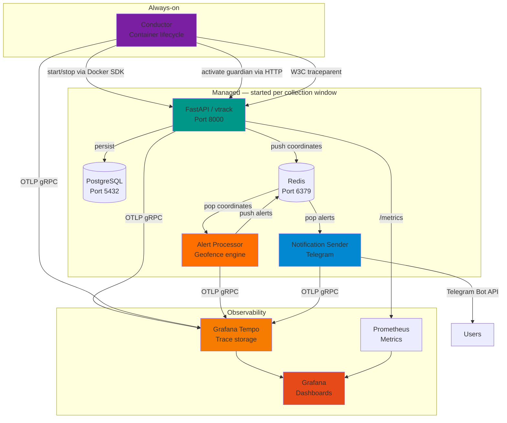

# VTrack — Real-Time Vehicle Tracking & Geofencing Platform

> A production-ready microservices platform for GPS tracking and geofence alerting, built with modern Python backend technologies.

[](https://github.com/josec-bckdev/vtrack/actions/workflows/tests.yml)
[](https://github.com/josec-bckdev/vtrack/actions/workflows/docker-build.yml)
[](https://github.com/josec-bckdev/vtrack/actions/workflows/linting.yml)


**[Documentation](docs/README.md) | [API Docs](http://localhost:8000/docs) | [Architecture](docs/architecture/overview.md)**

---

## What This Project Demonstrates

This is a **portfolio project** showcasing modern backend engineering practices:

- **Clean Architecture** — domain/ports/adapters/application/infrastructure layering enforced across every service
- **Microservices** — event-driven, independently managed services coordinated by a conductor
- **Distributed Tracing** — OpenTelemetry spans across all services, visualised in Grafana Tempo
- **TDD throughout** — strict red→green→refactor with Commitizen commit discipline
- **Container Lifecycle Orchestration** — always-on conductor starts/stops the managed stack around collection windows
- **Async Message Queues** — Redis-based producer-consumer pattern for coordinates and alerts
- **Real-time Processing** — sub-second geofence detection across configurable zones

Built as a real-world solution for tracking 100+ vehicles and sending instant Telegram notifications on zone entry/exit events.

---

## System Architecture



**Data flow:** `Conductor starts stack` → `Guardian triggers collection` → `GPS coordinates` → `Redis` → `Alert Processor` → `alerts` → `Notification Sender` → `Telegram`

**Trace flow:** `conductor.slot` → `guardian.slot.*` → `collection.run` → `cookie_refresh.run` (W3C traceparent propagation); `alert_processor.*` and `notification_sender.*` emit independent root spans correlated by `slot.date`.

See [architecture docs](docs/architecture/overview.md) for the full design.

---

## Engineering Highlights

### Core capabilities

| Capability | Implementation | Detail |
| --- | --- | --- |
| Container lifecycle | Conductor + Docker SDK | Starts/stops 5 services around two daily collection windows |
| Guardian state machine | `app/scheduler.py` | IDLE → WATCHING → STARTED/MISSED per slot |
| Distributed tracing | OpenTelemetry + Grafana Tempo | Full trace from conductor slot to collection run |
| Geofence detection | `shared/location_alerts.py` | Entry/exit detection against YAML-defined zones |
| Cookie refresh | ReAct loop in `app/cookie_refresh/` | Programmed browser steps via VNC container |
| Async data collection | `app/scraper_async.py` | Polls remote API, persists to PostgreSQL, enqueues to Redis |

### Technical stack

**Runtime:** Python 3.12, FastAPI, Uvicorn, async/await, Pydantic  
**Storage:** PostgreSQL 16 + Alembic, Redis 7  
**Tracing:** OpenTelemetry API/SDK 1.25, Grafana Tempo, Prometheus, Grafana  
**Infrastructure:** Docker Compose — 9 services total  
**Testing:** pytest, pytest-asyncio, pytest-cov — 427 tests, 97% coverage  
**Tooling:** Commitizen, mypy, flake8

### Architecture patterns

- **Clean Architecture** — `domain → ports → adapters → application → infrastructure` dependency rule enforced by code review and CLAUDE.md
- **Ports and Adapters (Hexagonal)** — `IRouteDataRepository`, `ICollectionStateStore`, `IVtrackGateway`, `IContainerGateway` ABCs; all mocked at port boundaries in tests
- **Repository Pattern** — `SqlAlchemyRouteRepository` behind `IRouteDataRepository`
- **State Machine** — Guardian (`IDLE → WATCHING → STARTED | MISSED`) in `app/scheduler.py`
- **ReAct loop** — Conductor observes → reasons → acts on container and slot state
- **Producer-Consumer** — Redis FIFO queues decoupling collection, alerting, and notification

---

## Quick Start

### Prerequisites

- Docker & Docker Compose
- Python 3.12+ (for local development)

### 1. Clone and configure

```bash
git clone https://github.com/josec-bckdev/vtrack.git
cd vtrack
cp .env.example .env
# Fill in POSTGRES_*, DATABASE_URL, TELEGRAM_BOT_TOKEN, LOGIN_EMAIL, LOGIN_PASSWORD
```

### 2. Start the stack

```bash
docker-compose up -d

# The conductor starts automatically (restart: always)
# It will start the managed services at the next collection window
# or immediately if you are already inside a window
```

### 3. Access services

| Service | URL |
| --- | --- |
| vtrack API | <http://localhost:8000> |
| Swagger UI | <http://localhost:8000/docs> |
| Grafana | <http://localhost:3000> |
| Prometheus | <http://localhost:9090> |
| Tempo (trace API) | <http://localhost:3200> |

### 4. Manually trigger a collection cycle

```bash
# Start collection (the conductor normally does this automatically)
curl -X POST http://localhost:8000/collect/start

# Check guardian state
curl http://localhost:8000/monitor/guardian

# Check collection status
curl http://localhost:8000/collect/status
```

---

## Project Structure

```
vtrack/
├── app/                            # vtrack — FastAPI application
│   ├── main.py                     # Routes, lifespan, OTel + scheduler wiring
│   ├── scheduler.py                # Guardian state machine (Scheduler class)
│   ├── scraper_async.py            # Async data collection (AsyncCollectionManager)
│   ├── tracing.py                  # OTel SDK setup (configure_tracing)
│   ├── monitoring.py               # /monitor/guardian endpoints
│   ├── models.py                   # SQLAlchemy models
│   ├── database.py                 # DB connection + session
│   ├── cookie_refresh/             # Programmed cookie refresh (ReAct pattern)
│   ├── domain/                     # Pure domain logic — no I/O, no frameworks
│   │   ├── scraper.py              # parse_remote_datetime, normalize_route_data, …
│   │   └── ports.py                # IRouteDataRepository, ICollectionStateStore ABCs
│   ├── adapters/                   # Port implementations
│   │   ├── route_repository.py     # SqlAlchemyRouteRepository
│   │   ├── collection_state.py     # InMemoryCollectionState
│   │   └── collection_status_adapter.py
│   └── tests/                      # 354 tests, 97% coverage
│
├── microservices/
│   ├── conductor/                  # Always-on container lifecycle orchestrator
│   │   ├── conductor.py            # Conductor (ReAct loop — startup + watch slot)
│   │   ├── domain/                 # ResourcePolicy, IVtrackGateway, IContainerGateway
│   │   ├── adapters/               # HttpxVtrackGateway, DockerContainerGateway, tracing.py
│   │   ├── main.py                 # Entrypoint — wires OTel + gateway + conductor
│   │   └── tests/                  # 62 tests
│   │
│   ├── alert-processor/            # Geofence detection consumer
│   │   ├── main.py                 # AlertConsumer — pops coordinates, emits OTel spans
│   │   ├── tracing.py              # configure_tracing for alert-processor
│   │   └── tests/                  # 5 OTel span tests
│   │
│   └── notification-sender/        # Alert delivery (Telegram)
│       ├── main.py                 # NotificationConsumer — pops alerts, emits OTel spans
│       ├── tracing.py              # configure_tracing for notification-sender
│       ├── providers/telegram.py   # Telegram Bot API
│       └── tests/
│
├── shared-package/                 # Installed Python package — used by all services
│   └── src/shared/
│       ├── message_queue.py        # Redis push/pop abstraction
│       ├── location_alerts.py      # LocationAnalyzer, LocationAlert, zone definitions
│       └── zones.yaml              # Geofence zone configuration
│
├── docker/                         # Infrastructure config files
│   ├── tempo/tempo.yaml            # OTLP receiver + local storage
│   ├── prometheus/prometheus.yml   # Scrapes vtrack /metrics
│   └── grafana/provisioning/       # Tempo + Prometheus datasources
│
├── docs/                           # Documentation
│   ├── architecture/               # System design, data flow, component details
│   └── guides/                     # Redis, alert processor, deployment, git conventions
│
├── previous-sprints/               # Archived session logs
├── NEXT_SESSION.md                 # Proposed next steps
├── CLAUDE.md                       # AI development guidelines (architecture contract, TDD rules)
└── docker-compose.yml              # Full stack — 9 services
```

---

## Running Tests

```bash
# vtrack core (354 tests)
pytest app/tests/ -v --cov=app --cov-report=term-missing

# Conductor (62 tests — run from microservice root)
cd microservices/conductor && python -m pytest tests/ -v

# Alert processor (5 OTel span tests)
cd microservices/alert-processor && python -m pytest tests/ -v

# Notification sender OTel
cd microservices/notification-sender && python -m pytest tests/test_notification_sender_otel.py -v
```

**427 tests total — all green.**

---

## Container Lifecycle

The **conductor** is the only service with `restart: always`. It owns the lifecycle of the other five:

```
On startup:
  if inside a collection window  → start stack, wait for health, activate guardian
  if outside                     → stop any running managed containers

Per slot (morning 05:00–06:40, afternoon 14:30–16:30):
  1. conductor.container.start   — docker start all 5 managed containers
  2. conductor.health.wait       — poll GET /monitor/health until 200
  3. conductor.guardian.activate — POST /monitor/guardian/activate
  4. conductor.resource.eval     — query Docker stats; decide whether to stop after slot
  5. conductor.slot.watch        — poll guardian state until collection completes
  6. (optional) stop all managed containers if memory threshold exceeded
```

---

## Observability

All four services export OTLP traces directly to Grafana Tempo (port 4317, gRPC). Trace context propagates from conductor to vtrack via the W3C `traceparent` HTTP header.

### Span inventory

| Service | Spans |
| --- | --- |
| conductor | `conductor.slot`, `.container.start`, `.health.wait`, `.guardian.activate`, `.resource.eval`, `.slot.watch` |
| vtrack | `guardian.slot.{name}`, `guardian.watching`, `guardian.collection.start`, `collection.run`, `cookie_refresh.run` |
| alert-processor | `alert_processor.coordinate.process`, `alert_processor.alert.queue` |
| notification-sender | `notification_sender.alert.send` |

### OTel architecture rule

`opentelemetry-api` only in application/domain layers. `opentelemetry-sdk` and exporters only in `tracing.py` (adapter) and `main.py` (infrastructure). This means OTel is a zero-cost no-op in all unit tests that don't configure a provider.

---

## Environment Variables

Required in `.env`:

```bash
# Database
POSTGRES_USER=vtrack
POSTGRES_PASSWORD=secure_password
POSTGRES_DB=vtrack_db
DATABASE_URL=postgresql://vtrack:secure_password@db:5432/vtrack_db

# Notifications
TELEGRAM_BOT_TOKEN=your_bot_token

# Scraper credentials
LOGIN_EMAIL=your_email
LOGIN_PASSWORD=your_password
```

Optional (set automatically by docker-compose):

```bash
REDIS_URL=redis://redis:6379/0
OTLP_ENDPOINT=http://tempo:4317   # set on api, conductor, alert-processor, notification-sender
```

---

## Deployment

```bash
# Build and start the full stack
docker-compose up -d --build

# The conductor manages collection windows automatically
# Check conductor logs to confirm slot timing
docker logs -f conductor

# Trace a collection cycle in Grafana
# open http://localhost:3000 → Explore → Tempo → service.name = "conductor"
```

---

## Roadmap

- [x] Guardian state machine (Layer 1)
- [x] Conductor container lifecycle (Layer 2)
- [x] OpenTelemetry distributed tracing (Layer 3)
- [ ] Prometheus custom metrics on vtrack — `vtrack_collection_total`, `vtrack_guardian_state`
- [ ] Grafana alert rules — alert on missed slots and slow collections (Layer 4)
- [ ] Deprecate `alert.severity` from domain model and Redis message schema
- [ ] WebSocket API for real-time dashboard
- [ ] Kubernetes deployment manifests

---

## Author

**Jose C**

- GitHub: [@josec-bckdev](https://github.com/josec-bckdev)
- LinkedIn: [Jose C](https://linkedin.com/in/yourprofile)
- Portfolio: [VTrack Project](https://github.com/josec-bckdev/vtrack)

---

**Version:** 2.0.0 (Layer 3 — OTel complete)
**Last Updated:** May 2026
**Status:** Production Ready
